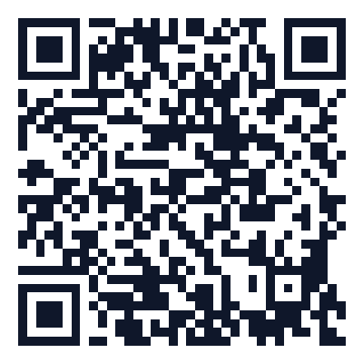

Track: C

# 🚀 Nokta Canvas & Autonomous Forge Engine (Final Week)

**Student:** Sudenur Yazıcı · `231118071`

## 📱 Mobile & Expo QR

Telefonunuzdaki **Expo Go** uygulamasıyla aşağıdaki QR kodu taratın:



> **📦 APK:** [`app-release.apk`](./app-release.apk) — Doğrudan indirip Android cihaza kurabilirsiniz.

## 🎬 Demo Video

<video src="./demo.mp4" controls width="100%"></video>

> 👆 Yukarıdaki oynatıcıdan projenin final demosunu doğrudan izleyebilirsiniz.

---

## 🌟 Final Hafta (Phase 3) Geliştirmeleri: "Halkayı Kapatıyoruz"

Bu proje, "Nokta" serüveninin halkayı kapatan final adımıdır. Aşağıdaki otonom ajan ve etkileşim özellikleri projeye başarıyla entegre edilmiştir:

- 🎙️ **Voice Visualizer & STT:** `expo-av` ve Web Audio API ile mikrofondan alınan ses dalgaları RMS/FFT üzerinden gerçek zamanlı görselleştirilir. Gürültü eşiğine göre barlar hareketlenir, sessizlikte söner. Ayrıca `<AuditWidget />` içindeki "Dikte Et" özelliği (`window.SpeechRecognition`) ile sesli komutlar otonom onarım için Markdown raporlarına dönüştürülür.
- 🪞 **Otonom Avatar (Viseme & Lipsync):** `avaturn.me` üzerinden oluşturulan kişisel 3D avatar (`avatar.glb`), `react-three-fiber` ile render edilmiştir. Ses şiddetine (AudioVolume) ve TTS dalgalarına bağlı olarak morph target'lar (jawOpen/MouthOpen) otonom tetiklenir ve avatar kusursuz senkronla konuşur. (T-pose sorunları için kemik rotasyonları ayarlanmıştır).
- 🛠️ **Forge Engine & Autonomous Repair:** `FORGE.md` üzerinde belgelenen otonom onarım döngüsü. Hata raporları otonom bir AI kodlayıcı ajan tarafından algılanır ve projedeki dosyalar insan müdahalesi olmadan onarılır. (Toplam 9 cycle başarılı şekilde dokümante edilmiştir).
- 📞 **STUCK Tespiti ve Görüntülü Köprü:** Otonom onarım ajanı üst üste 2 kez başarısız olursa (FAIL/ROLLBACK), sistem otomatik olarak STUCK durumuna geçer ve uzman (geliştirici) ile canlı **WebRTC (Jitsi)** görüntülü köprüsü kurar. Gerçekleştirilen görüşme transkriptleri otonom olarak `BRIDGE.md`'ye aktarılmış ve sonraki cycle'a context olarak beslenmiştir.

## 🛠️ Teknoloji Yığını

- **Core**: React Native (Expo) & Vite
- **AI**: Google Gemini API (1.5 Pro / 2.0 Flash) & Antigravity
- **3D & Avatar**: React Three Fiber, drei, Avaturn
- **Audio & Video**: Expo-AV, Web Audio API, WebRTC (Jitsi iframe)
- **Styling**: Tailwind CSS & React Native StyleSheet

## 🚀 Hızlı Başlangıç

### 1. Kurulum
Repoyu klonlayın ve bağımlılıkları yükleyin:
```bash
npm install
```

### 2. Ortam Değişkenleri
`.env.example` dosyasını `.env` olarak kopyalayın ve gerekli anahtarları ekleyin:
```env
VITE_GEMINI_API_KEY=AI-Studio-Key
VITE_GEMINI_MODEL=gemini-1.5-flash
```

### 3. Çalıştırma
```bash
npm run web
# veya
npm run android
```

---

## 📖 Decision Log
* **Karar 1:** CanvasSheet projesini referans alarak audit ve forge sistemini bu projenin üzerine kurduk. Projenin esnek mimarisi sayesinde AI araçlarının web ve mobil ortamda tam performansla onarım yapabileceğine inandık.
* **Karar 2:** **Track C (Otonomi)** seçilmiştir. Ratchet yaklaşımına uygun olarak human touch point'ler minimize edilmiş, otonom fail-safe mekanizmaları (WebRTC köprüsü) kurgulanmıştır.
* **Karar 3:** Otonom onarım döngüleri (başarılı olanlar ve rollback'ler) `FORGE.md` içerisine alınmış, STUCK durumundaki uzman müdahaleleri ise izole edilerek `BRIDGE.md` dosyasına taşınmıştır.

## 🤖 Kullanılan AI Tool Log'u
* Otonom düzeltme süreçlerinde **Gemini 1.5/2.0 Modelleri** ve **Antigravity (Coding Agent)** kullanılmıştır.
* "Report -> Fix" (Audit'ten Forge'a) Maintenance Pipeline otonom bir betik olan `forge-auto-fixer.js` ile sağlanmıştır.
* Avatar dudak senkronizasyonu için RPM standardı Viseme mapping (morphTargets) kullanılmıştır.

## ✋ Human Touch Points Sayısı: 1
* **Cycle #4** sırasında autonomous fixer'ın sonsuz döngüye girmesi üzerine sisteme insan eliyle müdahale edilmiş, watchdog restart edilmiş ve idempotency kuralı eklenmiştir.
* *(Bunun haricindeki Cycle #8'de yaşanan dosya yükleme STUCK durumu tamamen otonom olarak algoritma tarafından algılanmış ve WebRTC köprüsü üzerinden uzman çağrısı otomatik olarak fırlatılmıştır.)*
 
 
 
 
